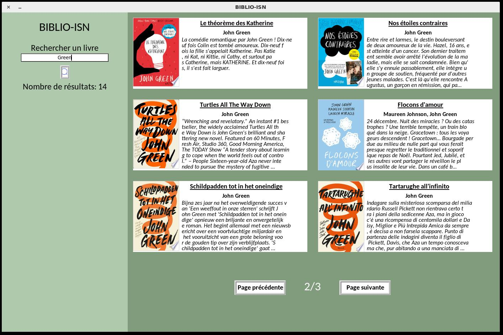
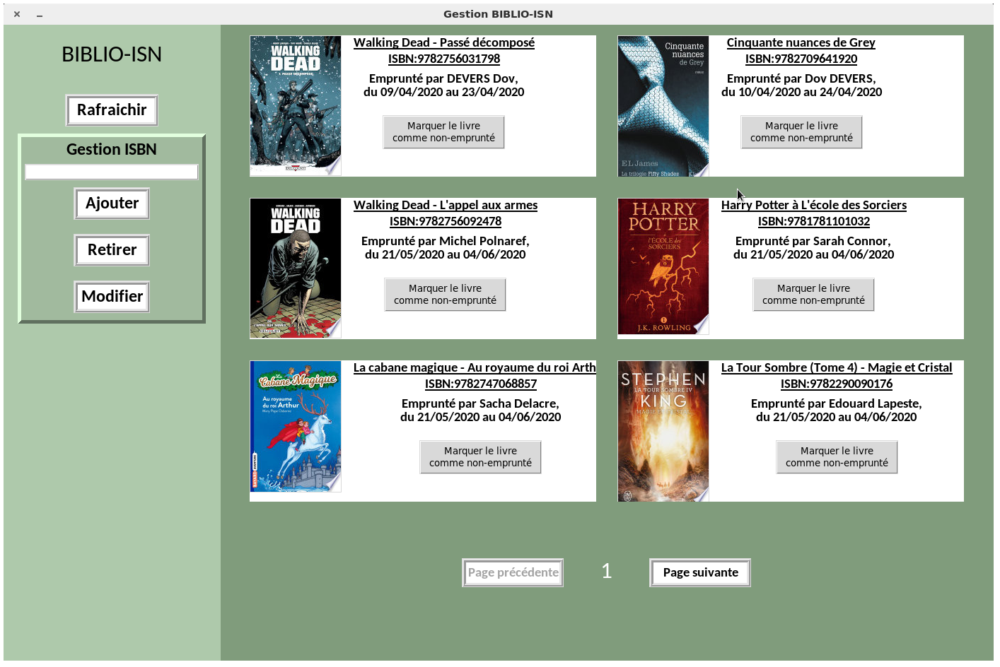
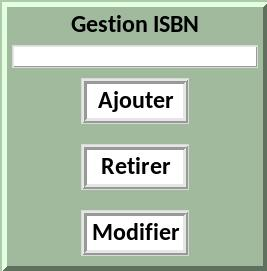
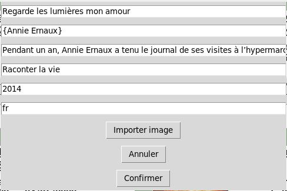
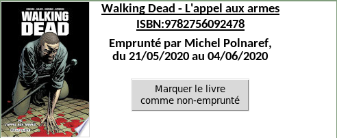

**BiblioISN**
=====
***Version 1.00***

BiblioISN est un logiciel Python 3 de gestion de livres pour les établissements scolaires, écrit par [Renaud-Dov DEVERS](https://github.com/Renaud-Dov) et [Ysilde Capet-Virbel](https://github.com/Newody)
*Il s'agit d'un projet scolaire en vue d'une épreuve du baccalauréat.*
## Installation

Utilisez le gestionnaire de paquets [pip](https://pip.pypa.io/en/stable/) pour installer les modules nécéssaires au bon fonctionnement du logiciel :

* ### [ISBNLIB](https://pypi.org/project/isbnlib/) (License [GNU 3](https://www.gnu.org/licenses/gpl-3.0.html))

```bash
pip install isbnlib
```
>ISBNLIB est une biliothèque utilisé pour télécharger les méta-données des livres à partir de leur ISBN. Les données sont récupérées sur la base de données [Google Books](https://books.google.com)

Pour la première utilisation, l'administrateur doit exécuter le <abbr title="init.py">fichier d'initialisation (init)</abbr>.

# Utilisation

### **Étudiants**
Pour démarrer le logiciel, il faut exécuter le programme ```"eleve_app.py"```



Dans l'onglet de gauche, les élèves peuvent lancer une recherche. Le moteur de recherche va chercher des correspondances partielles dans les titres et auteurs. Voir le module <abbr title="tools/research.py">research</abbr>.

Pour voir la fiche détaillé d'un livre, il suffit de cliquer dessus.


L'utilisateur peut voir la description du livre, plus d'autres informations.

* Si le livre n'a pas encore été réservé, l'élève peut le prendre pour une durée (paramétrée par la documentaliste).
Pour réserver le livre, il suffit de rentrer son nom et prénom.
* Dans le cas contraire, le logiciel indiquera à quelle date le livre devrait être de nouveau disponible. 

Sur la page de recherche, une icône indique si le livre est actuellement emprunté.


---
### **Documentalistes**
Pour s'occuper de la gestion des livres, des emprunts, il faut exécuter ***Remarque :*** *Il n'est pas possible actuellement d'avoir deux fois le même ISBN. Chaque livre ne peut être compatabilisé qu'une seule fois le programme* ```"gestion_app.py"```

L'administrateur a juste besoin de l'ISBN. Il peut ensuite effectuer différentes actions :



#### Ajouter un livre
* Mode automatique (Via ISBNLIB)

Le module ISBNLIB va trouver les informations exisantes disponible sur Google Books.

>Étant donné que le logiciel va télécharger les métadonnées en ligne, **une connexion internet est obligatoire pour pouvoir rajouter un livre en local**

* Mode Manuel
>**Le mode Manuel n'a pas encore été implenté dans la version actuelle (1.00)**

Le mode manuel permet de rentrer manuelement les données d'un livre.
>Le mode manuel ne requiert pas de connexion internet. De même, les images de couverture sont automatiquement redimensionnées.

***Remarque :*** _Il n'est pas possible actuellement d'avoir deux fois le même ISBN. Chaque livre ne peut être compatabilisé qu'une seule fois_


>Retourne une erreur si le livre est déjà dans la base de données.


#### Supprimer un livre
L'administrateur peut retirer le livre de la base de donnée. 
>Retourne une erreur si le livre n'est pas dans la base de données

#### Modifier un livre
L'administrateur peut modifier un livre de la base de donnée.

Interface non finalisée :



> Il est possible de modifier l'image de courverture. Les extensions compatibles sont le jpg et le png. Les images sont automatiquement redimensionnées et copiées dans le dossier ```image``` après confirmation.

#### Marquer un livre comme rendu



Il suffit de cliquer sur de marquer le livre comme non rendu.

# Bases de données
Les bases de données sont crées en ***Json***. Se trouvant dans le répertoire "/data", on y trouve de multiples bases de données listées ci dessous.

#### <abbr title="data/title.json">Titres</abbr>
Ce fichier json permet de lister en une seule base de donnée les titres.

```json
    {
    "9782092555729": "Le th\u00e9or\u00e8me des Katherine",
    "9782092543085": "Nos \u00e9toiles contraires",
    "9782291072652": "Emily Dickinson: Complete Poems",
    "9782013230858": "Le Horla - Texte int\u00e9gral",
    "9782370210395": "Regarde les lumi\u00e8res mon amour",
    "9782226449757": "Miroir de nos peines"
    }
```
#### <abbr title="data/authors.json">Auteurs</abbr>
Ce fichier json permet de lister en une seule base de donnée les auteurs et leurs livres.
```json
{   
    "9783540420576": ["Roger Godement"],
    "9783446240933": ["John Green"],
    "9780141355078": ["John Green"],
    "9782747056120": ["Mary Pope Osborne","Philippe Masson"]
}
```
#### <abbr title="data/reservation.json">Réservations</abbr>
Ce fichier json permet de lister en une seule base de donnée tous les emprunts de livre, avec les informations suivantes :

* Date d'emprunt
* Date maximale où le livre doit être rendu
* Nom de l'élève
```json
{
    "9782203001022":{
        "from": "12/04/2020",
        "to": "26/04/2020",
        "Name": "Name1 Surname1"
    },
    "9788416588725":{
    "from": "21/04/2020",
    "to": "05/05/2020",
    "Name": "Name2 Surname2"
    }
}
```
>***Remarque :*** *Le nombre maximum de livres pouvant être emprunté par un lecteur peut être modifié ou être désactivé. Par défaut, ce paramètre est défini sur 3.*

#### <abbr title="data/livres/{ISBN}.json">Fiche livre</abbr>
>Chaque livre possède sa propre fiche détaillée situé dans ```"data/livres/{ISBN}.json"```.

Exemple d'une fiche de livre :

```json
{
    "Book": {
        "Titre": "Harry Potter et le Prisonnier d'Azkaban",
        "Auteur": ["J.K. Rowling"],
        "Synopsis": "Sirius Black, le dangereux criminel qui s\u2019est \u00e9chapp\u00e9 de la forteresse d\u2019Azkaban, recherche Harry Potter. C\u2019est donc sous bonne garde que l\u2019apprenti sorcier fait sa troisi\u00e8me rentr\u00e9e. Au programme : des cours de divination, la fabrication d\u2019une potion de Ratatinage, le dressage des hippogriffes...",
        "publisher": "Pottermore Publishing",
        "year": "2015",
        "language": "fr",
        "img": "img/9781781101056.jpg",
        "added": "22/02/2020",
        "taken": false
    },
    "Notes": {"1": 2,"2": 4,"3": 4,"4": 3,"5": 3}
}
```
Les fiches contiennent les informations suivantes :

* Titre du livre
* Auteur(s)
* Description (Synopsis)
* Editeur
* Année de publication
* Langage
* Date d'ajout
* Chemin d'accès à l'image
* "taken" :
    * False : le livre n'a pas été emprunté
    * True : le livre a été emprunté

Il contient également une liste des notes émises par les utilisateurs.
