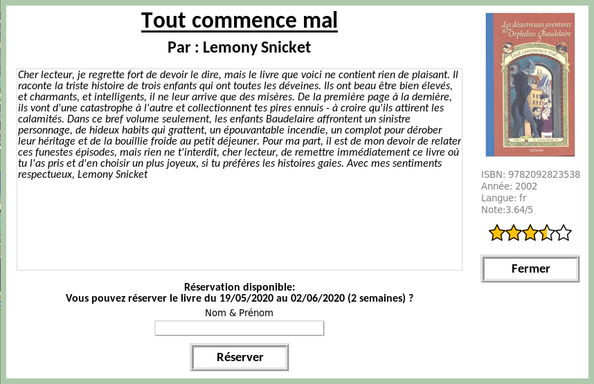

**BiblioISN**
=====
***Version 1.00***

BiblioISN est un logiciel Python 3 de gestion de livres pour les établissements scolaires.

## Installation

Utilisez le gestionnaire de paquets [pip](https://pip.pypa.io/en/stable/) pour installer les modules nécéssaires au bon fonctionnement du logiciel :

* ### [ISBNLIB](https://pypi.org/project/isbnlib/) (License [GNU 3](https://www.gnu.org/licenses/gpl-3.0.html))

```bash
pip install isbnlib
```
>ISBNLIB est une biliothèque utilisé pour télécharger les méta-données des livres à partir de leur ISBN. Les données sont récupérées sur la base de données [Google Books](https://books.google.com)

---

# Utilisation

### **Étudiants**
Pour démarrer le logiciel, il faut exécuter le programme "eleve_app.py"


Dans l'onglet de gauche, les élèves peuvent lancer une recherche. Le moteur de recherche va chercher des correspondances partielles dans les titres et auteurs. Voir le module <abbr title="tools/research.py">research</abbr>.

Pour voir la fiche détaillé d'un livre, il suffit de cliquer dessus.



L'utilisateur peut voir la description du livre, plus d'autres informations.

* Si le livre n'a pas encore été réservé, l'élève peut le prendre pour une durée (paramétrée par la documentaliste).
Pour réserver le livre, il suffit de rentrer son nom et prénom.
* Dans le cas contraire, la fiche ne proposera pas à l'élève de réserver le livre. 

Sur la page de recherche, une icône indique si le livre est actuellement emprunté.


---
### **Documentalistes**
Pour s'occuper de la gestion des livres, des emprunts, il faut exécuter ***Remarque :*** _Il n'est pas possible actuellement d'avoir deux fois le même ISBN. Chaque livre ne peut être compatabilisé qu'une seule fois_le programme "gestion_app.py"

L'administrateur a juste besoin de l'ISBN. Il peut ensuite effectuer différentes actions :

#### Ajouter un livre
* Mode automatique (Via ISBNLIB)

Le module ISBNLIB va trouver les informations exisantes disponible sur

>Étant donné que le logiciel va télécharger les métadonnées en ligne, **une connexion internet est obligatoire pour pouvoir rajouter un livre en local**

* Mode Manuel
>**Le mode Manuel n'a pas encore été implenté dans la version actuelle (1.00)**

Le mode manuel permet de rentrer manuelement les données d'un livre.
>Le mode manuel ne requiert pas de connexion internet. De même, les images de couverture sont automatiquement redimensionnées.

***Remarque :*** _Il n'est pas possible actuellement d'avoir deux fois le même ISBN. Chaque livre ne peut être compatabilisé qu'une seule fois_


>Retourne une erreur si le livre est déjà dans la base de données.


#### Supprimer un livre
L'administrateur peut retirer le livre de la base de donnée. Une telle action 
>Retourne une erreur si le livre n'est pas dans la base de données

#### Modifier un livre
Fonction non implémentée

# Base de donnée
Les bases de données sont crées en ***Json***. Se trouvant dans le répertoire "/data", on y trouve de multiples bases de données listées ci dessous.

#### <abbr title="data/title.json">Titres</abbr>
```json
    {
    "9782092555729": "Le th\u00e9or\u00e8me des Katherine",
    "9782092543085": "Nos \u00e9toiles contraires",
    "9782291072652": "Emily Dickinson: Complete Poems",
    "9782013230858": "Le Horla - Texte int\u00e9gral",
    "9782370210395": "Regarde les lumi\u00e8res mon amour",
    "9782226449757": "Miroir de nos peines"
    }
```
#### <abbr title="data/authors.json">Auteurs</abbr>
```json
{   
    "9783540420576": ["Roger Godement"],
    "9783446240933": ["John Green"],
    "9780141355078": ["John Green"],
    "9782747056120": ["Mary Pope Osborne","Philippe Masson"]
}
```
#### <abbr title="data/reservation.json">Réservations</abbr>
```json
{
    "9782203001022":{
        "from": "12/04/2020",
        "to": "26/04/2020",
        "Name": "Name1 Surname1"
    },
    "9788416588725":{
    "from": "21/04/2020",
    "to": "05/05/2020",
    "Name": "Name2 Surname2"
    }
}
```
#### <abbr title="data/livres/{ISBN}.json">Fiche livre</abbr>7

# Réservation
>***Remarque :*** *Le nombre maximum de livres pouvant être emprunté par un lecteur peut être modifié ou être désactivé. Par défaut, ce paramètre est défini sur 3.*
# Ajout de livres

```python
```